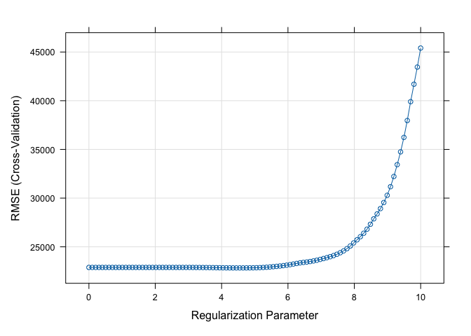
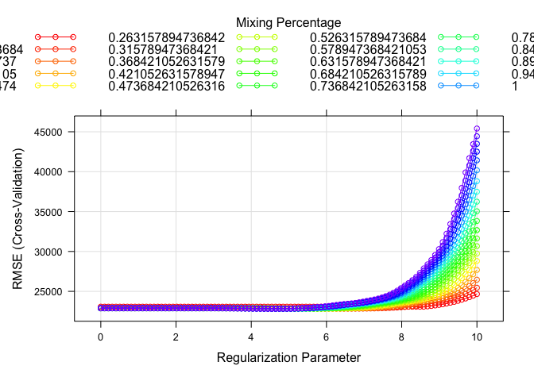
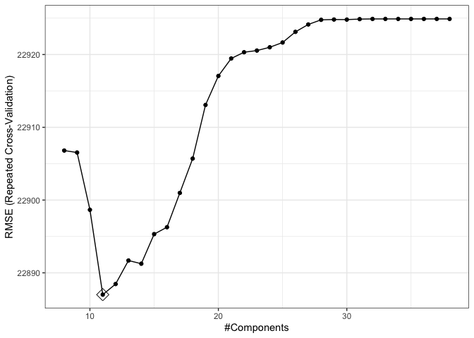

P8106 Homework1
================
Yuki Joyama
2024-02-10

``` r
# load libraries
library(tidyverse)
library(caret)
library(tidymodels)
library(plotmo)
library(kknn)
library(FNN) 
library(pls)

# read csv files 
df_test = read_csv("./data/housing_test.csv") |> 
  janitor::clean_names()
  
df_train = read_csv("./data/housing_training.csv") |> 
  janitor::clean_names()
```

## (a) Lasso model on the training data

I will use caret to fit a lasso model.

``` r
# set up 10-fold CV
ctrl1 <- trainControl(
  method = "cv",
  number = 10,
  selectionFunction = "best"
)

set.seed(1)

# find lambda by CV
lasso.fit <- 
  train(
    sale_price ~ .,
    data = df_train,
    method = "glmnet",
    tuneGrid = expand.grid(
      alpha = 1,
      lambda = exp(seq(10, 0, length = 100))
    ),
    trControl = ctrl1
  )

# plot RMSE and lambda
plot(lasso.fit, xTrans = log)
```

<!-- -->

``` r
# print the best tuning parameter
lasso.fit$bestTune
```

    ##    alpha   lambda
    ## 45     1 85.15256

``` r
# Obtain the test error
lasso.pred <- predict(lasso.fit, newdata = df_test)
mean((lasso.pred - pull(df_test, "sale_price"))^2) # test error
```

    ## [1] 438072450

The selected tuning parameter is $\lambda=$ 85.15 ($\alpha=$ 1)  
The test error is 438072450

Now, I will apply 1SE rule to obtain the most regularized model.

``` r
# apply 1SE rule 
ctrl2 <- trainControl(
  method = "cv",
  number = 10,
  selectionFunction = "oneSE"
)

set.seed(1)

lasso.fit_oneSE <- 
  train(
    sale_price ~ .,
    data = df_train,
    method = "glmnet",
    tuneGrid = expand.grid(
      alpha = 1,
      lambda = exp(seq(10, 0, length = 100))
    ),
    trControl = ctrl2
  )

# coefficients in the final model
coef(lasso.fit_oneSE$finalModel, s = lasso.fit_oneSE$bestTune$lambda)
```

    ## 40 x 1 sparse Matrix of class "dgCMatrix"
    ##                                       s1
    ## (Intercept)                -2.035204e+06
    ## gr_liv_area                 5.627213e+01
    ## first_flr_sf                1.135052e+00
    ## second_flr_sf               .           
    ## total_bsmt_sf               3.676775e+01
    ## low_qual_fin_sf            -2.527561e+01
    ## wood_deck_sf                8.229861e+00
    ## open_porch_sf               7.616474e+00
    ## bsmt_unf_sf                -1.929152e+01
    ## mas_vnr_area                1.429945e+01
    ## garage_cars                 3.083823e+03
    ## garage_area                 1.141257e+01
    ## year_built                  3.148994e+02
    ## tot_rms_abv_grd            -1.095718e+03
    ## full_bath                   .           
    ## overall_qualAverage        -3.000728e+03
    ## overall_qualBelow_Average  -8.923347e+03
    ## overall_qualExcellent       8.990728e+04
    ## overall_qualFair           -5.947217e+03
    ## overall_qualGood            9.687912e+03
    ## overall_qualVery_Excellent  1.596101e+05
    ## overall_qualVery_Good       3.592166e+04
    ## kitchen_qualFair           -4.951852e+03
    ## kitchen_qualGood            .           
    ## kitchen_qualTypical        -9.709739e+03
    ## fireplaces                  6.523369e+03
    ## fireplace_quFair            .           
    ## fireplace_quGood            4.642434e+03
    ## fireplace_quNo_Fireplace    .           
    ## fireplace_quPoor            .           
    ## fireplace_quTypical         .           
    ## exter_qualFair             -1.421715e+04
    ## exter_qualGood              .           
    ## exter_qualTypical          -5.155853e+03
    ## lot_frontage                6.825379e+01
    ## lot_area                    5.539988e-01
    ## longitude                  -9.095486e+03
    ## latitude                    1.446847e+04
    ## misc_val                    .           
    ## year_sold                   .

29 predictors are included in the model.

## (b) Elastic net model on the training data

``` r
# fit the model 
set.seed(1)

enet.fit <- 
  train(
    sale_price ~ .,
    data = df_train,
    method = "glmnet",
    tuneGrid = expand.grid(
      alpha = seq(0, 1, length = 20),
      lambda = exp(seq(10, 0, length = 100))
    ),
    trControl = ctrl1
  )

# check the best tuning parameter
enet.fit$bestTune
```

    ##      alpha   lambda
    ## 1945     1 85.15256

``` r
# plot RMSE, lambda and alpha
myCol <- rainbow(25)
myPar <- list(
  superpose.symbol = list(col = myCol),
  superpose.line = list(col = myCol)
)

plot(enet.fit, par.settings = myPar, xTrans = log)
```

<!-- -->

``` r
# coefficients in the final model
coef(enet.fit$finalModel, s = enet.fit$bestTune$lambda)
```

    ## 40 x 1 sparse Matrix of class "dgCMatrix"
    ##                                       s1
    ## (Intercept)                -4.779543e+06
    ## gr_liv_area                 6.511887e+01
    ## first_flr_sf                8.157776e-01
    ## second_flr_sf               .           
    ## total_bsmt_sf               3.548040e+01
    ## low_qual_fin_sf            -4.065028e+01
    ## wood_deck_sf                1.151876e+01
    ## open_porch_sf               1.519811e+01
    ## bsmt_unf_sf                -2.088608e+01
    ## mas_vnr_area                1.102794e+01
    ## garage_cars                 4.047643e+03
    ## garage_area                 8.262209e+00
    ## year_built                  3.227762e+02
    ## tot_rms_abv_grd            -3.552364e+03
    ## full_bath                  -3.699584e+03
    ## overall_qualAverage        -4.799583e+03
    ## overall_qualBelow_Average  -1.234991e+04
    ## overall_qualExcellent       7.623843e+04
    ## overall_qualFair           -1.062514e+04
    ## overall_qualGood            1.207027e+04
    ## overall_qualVery_Excellent  1.370861e+05
    ## overall_qualVery_Good       3.785078e+04
    ## kitchen_qualFair           -2.430114e+04
    ## kitchen_qualGood           -1.672052e+04
    ## kitchen_qualTypical        -2.486961e+04
    ## fireplaces                  1.029185e+04
    ## fireplace_quFair           -7.613692e+03
    ## fireplace_quGood            .           
    ## fireplace_quNo_Fireplace    1.035629e+03
    ## fireplace_quPoor           -5.590922e+03
    ## fireplace_quTypical        -7.007746e+03
    ## exter_qualFair             -3.206346e+04
    ## exter_qualGood             -1.390479e+04
    ## exter_qualTypical          -1.835565e+04
    ## lot_frontage                9.883182e+01
    ## lot_area                    6.041112e-01
    ## longitude                  -3.239683e+04
    ## latitude                    5.394703e+04
    ## misc_val                    8.002273e-01
    ## year_sold                  -5.356063e+02

``` r
# obtain predicted values
enet.pred <- predict(enet.fit, newdata = df_test)

# test error
mean((enet.pred - pull(df_test, "sale_price"))^2)
```

    ## [1] 438072450

The selected tuning parameter is $\lambda=$ 85.15 and $\alpha=$ 1 The
test error is 438072450

1SE rule can be applied in $\lambda$s for each $\alpha$.

``` r
# apply 1SE rule 
set.seed(1)

enet.fit_oneSE <- 
  train(
    sale_price ~ .,
    data = df_train,
    method = "glmnet",
    tuneGrid = expand.grid(
      alpha = seq(0, 1, length = 20),                                    
      lambda = exp(seq(10, 0, length = 100))
    ),
    trControl = ctrl2
  )

# check the tuning parameters
enet.fit_oneSE$bestTune
```

    ##    alpha   lambda
    ## 93     0 10860.95

Now, the optimal tuning parameters are $\lambda=$ 10860.95 and $\alpha=$
0

## (c) Partial least squares model on the training data

``` r
# using caret
# set cv
ctrl3 <- trainControl(
  method = "repeatedcv",
  number = 10,
  repeats = 5,
  selectionFunction = "best"
)

# prepare x and y
# training 
x <- model.matrix(sale_price ~ ., df_train)[, -1]
y <- df_train$sale_price

# test
x2 <- model.matrix(sale_price ~ ., df_test)[, -1]
y2 <- df_test$sale_price

# fit a partial least squares model on the training data
set.seed(2)

pls.fit <- train(
  x, y,
  method = "pls",
  tuneGrid = data.frame(ncomp = 8:38),
  trControl = ctrl3,
  preProcess = c("center", "scale")
)

summary(pls.fit)
```

    ## Data:    X dimension: 1440 39 
    ##  Y dimension: 1440 1
    ## Fit method: oscorespls
    ## Number of components considered: 11
    ## TRAINING: % variance explained
    ##           1 comps  2 comps  3 comps  4 comps  5 comps  6 comps  7 comps
    ## X           20.02    25.93    29.67    33.59    37.01    40.03    42.49
    ## .outcome    79.73    86.35    89.36    90.37    90.87    90.99    91.06
    ##           8 comps  9 comps  10 comps  11 comps
    ## X           45.53    47.97     50.15     52.01
    ## .outcome    91.08    91.10     91.13     91.15

``` r
# obtain predicted values 
pred.pls <- predict(
  pls.fit, 
  newdata = x2
)

# visualize RMSE and the number of components
ggplot(pls.fit, highlight = T) + theme_bw()
```

<!-- -->

``` r
# test MSE
mean((pred.pls - y2)^2)
```

    ## [1] 451276530

11 components are included in the partial least squares model on the
training data.  
The test error is 451276530

## (d) The best model for response prediction

## (e) Alternative meta-engine
