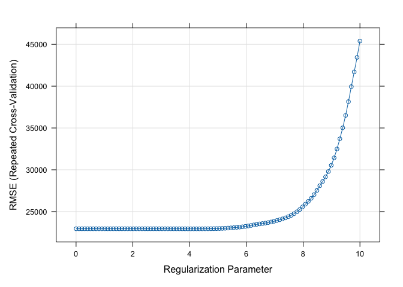

P8106 Homework1
================
Yuki Joyama
2024-02-10

``` r
# load libraries
library(tidyverse)
library(caret)
library(tidymodels)
library(plotmo)
library(kknn)
library(FNN) 

# read csv files 
df_test = read_csv("./data/housing_test.csv") |> 
  janitor::clean_names()
  
df_train = read_csv("./data/housing_training.csv") |> 
  janitor::clean_names()
```

## (a) Lasso model on the training data

I will use caret to fit a lasso model.

``` r
# set up 10-fold CV
ctrl1 <- trainControl(
  method = "cv",
  number = 10
)

set.seed(1)

lasso.fit <- 
  train(
    sale_price ~ .,
    data = df_train,
    method = "glmnet",
    tuneGrid = expand.grid(
      alpha = 1,
      lambda = exp(seq(10, 0, length = 100))
    ),
    trControl = ctrl1
  )

# plot RMSE and lambda
plot(lasso.fit, xTrans = log)
```

<!-- -->

``` r
# print the best tuning parameter
lasso.fit$bestTune$lambda
```

    ## [1] 85.15256

``` r
# Obtain the test error
coef(lasso.fit$finalModel, s = lasso.fit$bestTune$lambda)
```

    ## 40 x 1 sparse Matrix of class "dgCMatrix"
    ##                                       s1
    ## (Intercept)                -4.779543e+06
    ## gr_liv_area                 6.511887e+01
    ## first_flr_sf                8.157776e-01
    ## second_flr_sf               .           
    ## total_bsmt_sf               3.548040e+01
    ## low_qual_fin_sf            -4.065028e+01
    ## wood_deck_sf                1.151876e+01
    ## open_porch_sf               1.519811e+01
    ## bsmt_unf_sf                -2.088608e+01
    ## mas_vnr_area                1.102794e+01
    ## garage_cars                 4.047643e+03
    ## garage_area                 8.262209e+00
    ## year_built                  3.227762e+02
    ## tot_rms_abv_grd            -3.552364e+03
    ## full_bath                  -3.699584e+03
    ## overall_qualAverage        -4.799583e+03
    ## overall_qualBelow_Average  -1.234991e+04
    ## overall_qualExcellent       7.623843e+04
    ## overall_qualFair           -1.062514e+04
    ## overall_qualGood            1.207027e+04
    ## overall_qualVery_Excellent  1.370861e+05
    ## overall_qualVery_Good       3.785078e+04
    ## kitchen_qualFair           -2.430114e+04
    ## kitchen_qualGood           -1.672052e+04
    ## kitchen_qualTypical        -2.486961e+04
    ## fireplaces                  1.029185e+04
    ## fireplace_quFair           -7.613692e+03
    ## fireplace_quGood            .           
    ## fireplace_quNo_Fireplace    1.035629e+03
    ## fireplace_quPoor           -5.590922e+03
    ## fireplace_quTypical        -7.007746e+03
    ## exter_qualFair             -3.206346e+04
    ## exter_qualGood             -1.390479e+04
    ## exter_qualTypical          -1.835565e+04
    ## lot_frontage                9.883182e+01
    ## lot_area                    6.041112e-01
    ## longitude                  -3.239683e+04
    ## latitude                    5.394703e+04
    ## misc_val                    8.002273e-01
    ## year_sold                  -5.356063e+02

``` r
lasso.pred <- predict(lasso.fit, newdata = df_test)

mean((lasso.pred - pull(df_test, "sale_price"))^2)
```

    ## [1] 438072450

The selected tuning parameter is $\lambda=$ 85.15256 ($\alpha=$ 1)  
The test error is 438072450

## (b) Elastic net model on the training data

## (c) Partial least squares model on the training data

## (d) The best model for response prediction

## (e) Alternative meta-engine
