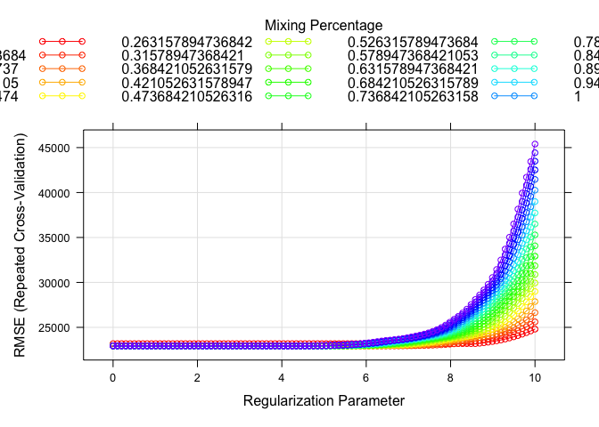
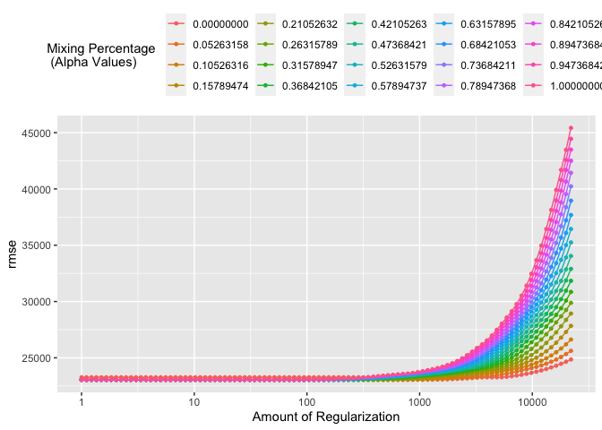

P8106 Homework1
================
Yuki Joyama
2024-02-10

``` r
# load libraries
library(tidyverse)
library(caret)
library(tidymodels)
library(plotmo)
library(kknn)
library(FNN) 
library(pls)

# read csv files 
df_test = read_csv("./data/housing_test.csv") |> 
  janitor::clean_names()
  
df_train = read_csv("./data/housing_training.csv") |> 
  janitor::clean_names()
```

## (a) Lasso model on the training data

I will use caret to fit a lasso model.

``` r
# set up 10-fold CV
ctrl1 <- trainControl(
  method = "repeatedcv",
  number = 10,
  repeats = 5,
  selectionFunction = "best"
)

set.seed(1)

# find lambda by CV
lasso.fit <- 
  train(
    sale_price ~ .,
    data = df_train,
    method = "glmnet",
    tuneGrid = expand.grid(
      alpha = 1,
      lambda = exp(seq(10, 0, length = 100))
    ),
    trControl = ctrl1
  )

# plot RMSE and lambda
plot(lasso.fit, xTrans = log)
```

<!-- -->

``` r
# print the best tuning parameter
lasso.fit$bestTune
```

    ##    alpha  lambda
    ## 42     1 62.8917

``` r
# Obtain the test error
lasso.pred <- predict(lasso.fit, newdata = df_test)
mean((lasso.pred - pull(df_test, "sale_price"))^2) # test error
```

    ## [1] 440215066

The selected tuning parameter is $\lambda=$ 62.89 ($\alpha=$ 1)  
The test error is 440215066

Now, I will apply 1SE rule to obtain the most regularized model.

``` r
# apply 1SE rule 
ctrl2 <- trainControl(
  method = "repeatedcv",
  number = 10,
  repeats = 5,
  selectionFunction = "oneSE"
)

set.seed(1)

lasso.fit_oneSE <- 
  train(
    sale_price ~ .,
    data = df_train,
    method = "glmnet",
    tuneGrid = expand.grid(
      alpha = 1,
      lambda = exp(seq(10, 0, length = 100))
    ),
    trControl = ctrl2
  )

# coefficients in the final model
coef(lasso.fit_oneSE$finalModel, s = lasso.fit_oneSE$bestTune$lambda)
```

    ## 40 x 1 sparse Matrix of class "dgCMatrix"
    ##                                       s1
    ## (Intercept)                -3.967225e+06
    ## gr_liv_area                 6.116858e+01
    ## first_flr_sf                9.422068e-01
    ## second_flr_sf               .           
    ## total_bsmt_sf               3.624249e+01
    ## low_qual_fin_sf            -3.564387e+01
    ## wood_deck_sf                1.008785e+01
    ## open_porch_sf               1.221931e+01
    ## bsmt_unf_sf                -2.061856e+01
    ## mas_vnr_area                1.290135e+01
    ## garage_cars                 3.516368e+03
    ## garage_area                 9.683597e+00
    ## year_built                  3.154577e+02
    ## tot_rms_abv_grd            -2.564604e+03
    ## full_bath                  -1.521328e+03
    ## overall_qualAverage        -4.050185e+03
    ## overall_qualBelow_Average  -1.091854e+04
    ## overall_qualExcellent       8.683918e+04
    ## overall_qualFair           -8.861656e+03
    ## overall_qualGood            1.116048e+04
    ## overall_qualVery_Excellent  1.555241e+05
    ## overall_qualVery_Good       3.733021e+04
    ## kitchen_qualFair           -1.484041e+04
    ## kitchen_qualGood           -8.241031e+03
    ## kitchen_qualTypical        -1.699737e+04
    ## fireplaces                  8.310271e+03
    ## fireplace_quFair           -4.071334e+03
    ## fireplace_quGood            2.028562e+03
    ## fireplace_quNo_Fireplace    .           
    ## fireplace_quPoor           -1.756346e+03
    ## fireplace_quTypical        -4.345175e+03
    ## exter_qualFair             -1.703686e+04
    ## exter_qualGood              .           
    ## exter_qualTypical          -4.789024e+03
    ## lot_frontage                8.725771e+01
    ## lot_area                    5.924384e-01
    ## longitude                  -2.295215e+04
    ## latitude                    3.846862e+04
    ## misc_val                    3.376656e-01
    ## year_sold                  -1.809022e+02

``` r
# Obtain the test error
lasso.pred_oneSE <- predict(lasso.fit_oneSE, newdata = df_test)
mean((lasso.pred_oneSE - pull(df_test, "sale_price"))^2) # test error
```

    ## [1] 421099983

36 predictors are included in the model.

## (b) Elastic net model on the training data

``` r
# fit the model 
set.seed(1)

enet.fit <- 
  train(
    sale_price ~ .,
    data = df_train,
    method = "glmnet",
    tuneGrid = expand.grid(
      alpha = seq(0, 1, length = 20),
      lambda = exp(seq(10, 0, length = 100))
    ),
    trControl = ctrl1
  )

# check the best tuning parameter
enet.fit$bestTune
```

    ##          alpha   lambda
    ## 164 0.05263158 580.3529

``` r
# plot RMSE, lambda and alpha
myCol <- rainbow(25)
myPar <- list(
  superpose.symbol = list(col = myCol),
  superpose.line = list(col = myCol)
)

plot(enet.fit, par.settings = myPar, xTrans = log)
```

<!-- -->

``` r
# coefficients in the final model
coef(enet.fit$finalModel, s = enet.fit$bestTune$lambda)
```

    ## 40 x 1 sparse Matrix of class "dgCMatrix"
    ##                                       s1
    ## (Intercept)                -5.113316e+06
    ## gr_liv_area                 3.888606e+01
    ## first_flr_sf                2.659339e+01
    ## second_flr_sf               2.534167e+01
    ## total_bsmt_sf               3.495196e+01
    ## low_qual_fin_sf            -1.596905e+01
    ## wood_deck_sf                1.231770e+01
    ## open_porch_sf               1.686371e+01
    ## bsmt_unf_sf                -2.072999e+01
    ## mas_vnr_area                1.165591e+01
    ## garage_cars                 4.046669e+03
    ## garage_area                 8.894532e+00
    ## year_built                  3.191010e+02
    ## tot_rms_abv_grd            -3.439303e+03
    ## full_bath                  -3.693423e+03
    ## overall_qualAverage        -5.113423e+03
    ## overall_qualBelow_Average  -1.269944e+04
    ## overall_qualExcellent       7.586249e+04
    ## overall_qualFair           -1.145724e+04
    ## overall_qualGood            1.197943e+04
    ## overall_qualVery_Excellent  1.364598e+05
    ## overall_qualVery_Good       3.765074e+04
    ## kitchen_qualFair           -2.367794e+04
    ## kitchen_qualGood           -1.610305e+04
    ## kitchen_qualTypical        -2.415426e+04
    ## fireplaces                  1.080415e+04
    ## fireplace_quFair           -7.895400e+03
    ## fireplace_quGood            1.050416e+02
    ## fireplace_quNo_Fireplace    1.745086e+03
    ## fireplace_quPoor           -5.840965e+03
    ## fireplace_quTypical        -7.003111e+03
    ## exter_qualFair             -3.285657e+04
    ## exter_qualGood             -1.445844e+04
    ## exter_qualTypical          -1.905526e+04
    ## lot_frontage                1.001013e+02
    ## lot_area                    6.031323e-01
    ## longitude                  -3.514521e+04
    ## latitude                    5.771438e+04
    ## misc_val                    8.665642e-01
    ## year_sold                  -5.730607e+02

``` r
# obtain predicted values
enet.pred <- predict(enet.fit, newdata = df_test)

# test error
mean((enet.pred - pull(df_test, "sale_price"))^2)
```

    ## [1] 438502352

The selected tuning parameters are $\lambda=$ 580.35 and $\alpha=$
0.0526 The test error is 438502352

1SE rule can be applied in $\lambda$s for each $\alpha$.

``` r
# apply 1SE rule 
set.seed(1)

enet.fit_oneSE <- 
  train(
    sale_price ~ .,
    data = df_train,
    method = "glmnet",
    tuneGrid = expand.grid(
      alpha = seq(0, 1, length = 20),                                    
      lambda = exp(seq(10, 0, length = 100))
    ),
    trControl = ctrl2
  )

# check the tuning parameters
enet.fit_oneSE$bestTune
```

    ##    alpha   lambda
    ## 87     0 5924.601

``` r
# Obtain the test error
enet.pred_oneSE <- predict(enet.fit_oneSE, newdata = df_test)
mean((enet.pred_oneSE - pull(df_test, "sale_price"))^2) # test error
```

    ## [1] 426417643

Now, the optimal tuning parameters are $\lambda=$ 5924.60 and $\alpha=$
0

## (c) Partial least squares model on the training data

``` r
# using caret

# prepare x and y
# training 
x <- model.matrix(sale_price ~ ., df_train)[, -1]
y <- df_train$sale_price

# test
x2 <- model.matrix(sale_price ~ ., df_test)[, -1]
y2 <- df_test$sale_price

# fit a partial least squares model on the training data
set.seed(2)

pls.fit <- train(
  x, y,
  method = "pls",
  tuneGrid = data.frame(ncomp = 8:38),
  trControl = ctrl1,
  preProcess = c("center", "scale")
)

summary(pls.fit)
```

    ## Data:    X dimension: 1440 39 
    ##  Y dimension: 1440 1
    ## Fit method: oscorespls
    ## Number of components considered: 11
    ## TRAINING: % variance explained
    ##           1 comps  2 comps  3 comps  4 comps  5 comps  6 comps  7 comps
    ## X           20.02    25.93    29.67    33.59    37.01    40.03    42.49
    ## .outcome    79.73    86.35    89.36    90.37    90.87    90.99    91.06
    ##           8 comps  9 comps  10 comps  11 comps
    ## X           45.53    47.97     50.15     52.01
    ## .outcome    91.08    91.10     91.13     91.15

``` r
# obtain predicted values 
pred.pls <- predict(
  pls.fit, 
  newdata = x2
)

# visualize RMSE and the number of components
ggplot(pls.fit, highlight = T) + theme_bw()
```

<!-- -->

``` r
# test MSE
mean((pred.pls - y2)^2)
```

    ## [1] 451276530

11 components are included in the partial least squares model on the
training data.  
The test error is 451276530

## (d) The best model for response prediction

``` r
# compare models

# resampling 
resamp <- resamples(list(
  lasso = lasso.fit,
  lasso_oneSE = lasso.fit_oneSE,
  elastic_net = enet.fit,
  elastic_net_oneSE = enet.fit_oneSE,
  pls = pls.fit
))

summary(resamp)
```

    ## 
    ## Call:
    ## summary.resamples(object = resamp)
    ## 
    ## Models: lasso, lasso_oneSE, elastic_net, elastic_net_oneSE, pls 
    ## Number of resamples: 50 
    ## 
    ## MAE 
    ##                       Min.  1st Qu.   Median     Mean  3rd Qu.     Max. NA's
    ## lasso             13538.32 15959.78 16652.47 16657.11 17452.75 19127.21    0
    ## lasso_oneSE       13606.88 16028.59 16825.09 16650.35 17418.16 19208.65    0
    ## elastic_net       13491.26 15931.74 16567.00 16626.04 17391.32 19166.57    0
    ## elastic_net_oneSE 13198.39 16034.65 16689.20 16607.47 17394.40 19493.07    0
    ## pls               14022.76 15696.11 16734.02 16686.61 17486.46 20931.03    0
    ## 
    ## RMSE 
    ##                       Min.  1st Qu.   Median     Mean  3rd Qu.     Max. NA's
    ## lasso             17877.16 21592.59 22994.31 22941.14 24142.02 29904.32    0
    ## lasso_oneSE       18237.15 21713.36 23427.26 23228.85 24447.39 30363.08    0
    ## elastic_net       17874.28 21565.57 23019.54 22936.41 24167.06 29954.34    0
    ## elastic_net_oneSE 18291.48 21318.48 23316.47 23232.16 24593.61 31328.11    0
    ## pls               19625.67 21393.49 22481.30 22887.00 24395.86 28462.45    0
    ## 
    ## Rsquared 
    ##                        Min.   1st Qu.    Median      Mean   3rd Qu.      Max.
    ## lasso             0.8605656 0.8924796 0.9073985 0.9031727 0.9149599 0.9394451
    ## lasso_oneSE       0.8593829 0.8916811 0.9038715 0.9010143 0.9118504 0.9365696
    ## elastic_net       0.8603663 0.8931082 0.9069821 0.9032425 0.9146348 0.9393994
    ## elastic_net_oneSE 0.8553709 0.8942059 0.9035794 0.9013262 0.9123490 0.9362294
    ## pls               0.8553670 0.8909901 0.9036199 0.9037282 0.9180389 0.9399278
    ##                   NA's
    ## lasso                0
    ## lasso_oneSE          0
    ## elastic_net          0
    ## elastic_net_oneSE    0
    ## pls                  0

``` r
# visualize RMSEs 
bwplot(resamp, metric = "RMSE")
```

<!-- -->

I choose the partial least square model as the best model in this
practice because it has the smallest mean of RMSE among five models.

## (e) Alternative meta-engine

I used caret in (b), so I will retrain the model with tidymodels.

``` r
# set up cv (10 fold)
set.seed(2)
cv_folds <- vfold_cv(df_train, v = 10)

# using tidymodels
enet_spec <- linear_reg(penalty = tune(), mixture = tune()) |> 
  set_engine("glmnet") |> 
  set_mode("regression")

# set the grid for lambda and alpha
enet_grid_set <- parameters(
  penalty(range = c(0, 10), trans = log_trans()), # lambda exp(0)-exp(10)
  mixture(range = c(0, 1)) # alpha 0 - 1
)

# set levels for lambda and alpha
enet_grid <- grid_regular(enet_grid_set, levels = c(100, 20))

enet_workflow <- workflow() |> 
  add_model(enet_spec) |> 
  add_formula(sale_price ~ .)

# use cv to fit the elastic net model
enet_tune <- tune_grid(
  enet_workflow,
  resamples = cv_folds,
  grid = enet_grid
)

# visualize RMSE and tuning parameters
autoplot(enet_tune, metric = "rmse") +
  theme(legend.position = "top") +
  labs(color = "Mixing Percentage \n (Alpha Values)")
```

<!-- -->

``` r
# select the best tuning parameters
enet_best <- select_best(enet_tune, metric = "rmse")
enet_best
```

    ## # A tibble: 1 × 3
    ##   penalty mixture .config                
    ##     <dbl>   <dbl> <chr>                  
    ## 1    642.  0.0526 Preprocessor1_Model0165

``` r
# final model
final_enet_spec <- enet_spec |> 
  update(penalty = enet_best$penalty, mixture = enet_best$mixture)

enet_fit <- fit(final_enet_spec, formula = sale_price ~ ., data = df_train)

# get coefficients
enet_model <- extract_fit_engine(enet_fit)
coef(enet_model, s = enet_best$penalty)
```

    ## 40 x 1 sparse Matrix of class "dgCMatrix"
    ##                                       s1
    ## (Intercept)                -5.117750e+06
    ## gr_liv_area                 3.875965e+01
    ## first_flr_sf                2.652197e+01
    ## second_flr_sf               2.522278e+01
    ## total_bsmt_sf               3.491296e+01
    ## low_qual_fin_sf            -1.600666e+01
    ## wood_deck_sf                1.234578e+01
    ## open_porch_sf               1.692256e+01
    ## bsmt_unf_sf                -2.070535e+01
    ## mas_vnr_area                1.177486e+01
    ## garage_cars                 4.027765e+03
    ## garage_area                 9.004748e+00
    ## year_built                  3.185051e+02
    ## tot_rms_abv_grd            -3.394479e+03
    ## full_bath                  -3.617682e+03
    ## overall_qualAverage        -5.120434e+03
    ## overall_qualBelow_Average  -1.268867e+04
    ## overall_qualExcellent       7.608294e+04
    ## overall_qualFair           -1.149660e+04
    ## overall_qualGood            1.194644e+04
    ## overall_qualVery_Excellent  1.368943e+05
    ## overall_qualVery_Good       3.761252e+04
    ## kitchen_qualFair           -2.344583e+04
    ## kitchen_qualGood           -1.588577e+04
    ## kitchen_qualTypical        -2.394984e+04
    ## fireplaces                  1.077050e+04
    ## fireplace_quFair           -7.944517e+03
    ## fireplace_quGood            6.866081e+01
    ## fireplace_quNo_Fireplace    1.616524e+03
    ## fireplace_quPoor           -5.887859e+03
    ## fireplace_quTypical        -7.040612e+03
    ## exter_qualFair             -3.244018e+04
    ## exter_qualGood             -1.405155e+04
    ## exter_qualTypical          -1.867531e+04
    ## lot_frontage                9.988078e+01
    ## lot_area                    6.030622e-01
    ## longitude                  -3.513064e+04
    ## latitude                    5.756778e+04
    ## misc_val                    8.609877e-01
    ## year_sold                  -5.667994e+02

``` r
# obtain test RMSE
enet.pred_tidy <- predict(enet_fit, new_data = df_test)
# RMSE
sqrt(mean((enet.pred_tidy[[1]] - pull(df_test, "sale_price"))^2))
```

    ## [1] 20922.95

The selected tuning parameters in this model are $\lambda=$ 642.04 and
$\alpha=$ 0.0526

Although the $\alpha$ is the same, the selected $\lambda$ is different
580.35 in caret. This may be due to the different calclation methods
used in each package.
